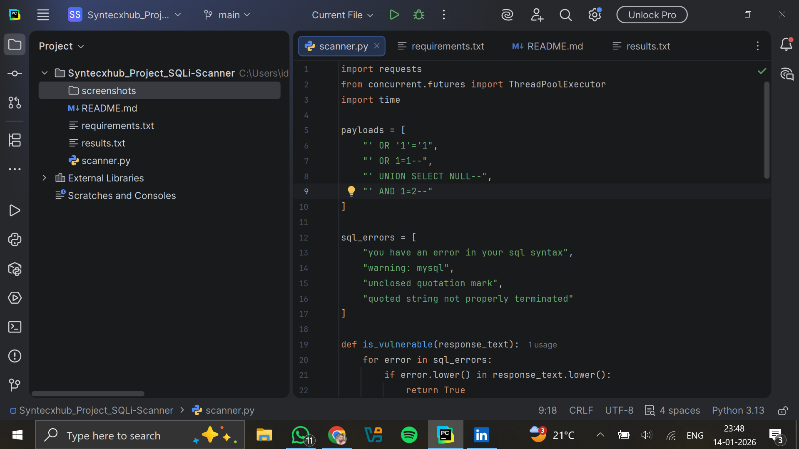
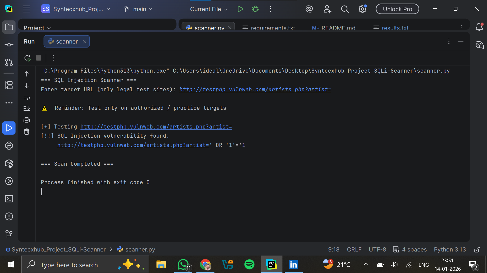

🔐 Web Vulnerability Scanner
📌 About the Project

This project is a Web Vulnerability Scanner developed to analyze user-provided websites and identify potential security weaknesses.
Initially, the scanner was limited to testing DVWA (Damn Vulnerable Web Application) only, but it has now been enhanced to accept dynamic user input, allowing security testing on multiple demo and practice websites.

The tool helps beginners understand how vulnerabilities are detected and how security posture can be evaluated in a controlled environment.

⚙️ How It Works

The user enters a target website URL.

The scanner sends automated requests to the provided site.

It checks for common vulnerabilities such as:

SQL Injection

Cross-Site Scripting (XSS)

Improper Input Validation

Basic Security Misconfigurations

After analysis, the tool generates a vulnerability status report showing:

Detected issues

Risk level

Basic mitigation guidance

🌐 Supported Targets

This scanner can be used on:

Practice labs like DVWA, bWAPP, OWASP Juice Shop

Any sample or demo website

Locally hosted test applications

⚠️ This tool is intended only for legal and authorized security testing.

🎯 Key Features

Accepts dynamic user input (no hardcoded targets)

Works with multiple testing environments

Beginner-friendly design

Generates clear and simple vulnerability status

Ideal for ethical hacking learning and practice

## 📸 Project Screenshots

### 🔹 Code Implementation

### 🔹 Scanner Output
## 📸 Project Screenshots

### 🔹 Code Implementation

### 🔹 Scanner Output

### 🔹 Scanner Output

⚠️ Disclaimer

This project is developed strictly for educational and ethical purposes.
Do not use this tool on any live or production website without proper authorization.
The developer is not responsible for any misuse of this tool.

👨‍💻 Developed By

Vinayak Rudrawar
Cybersecurity Enthusiast | Cyber Security Intern and learner
